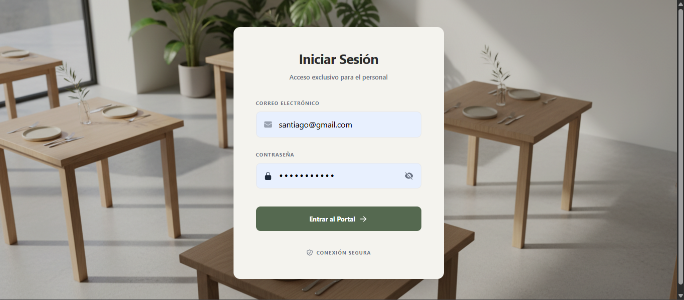
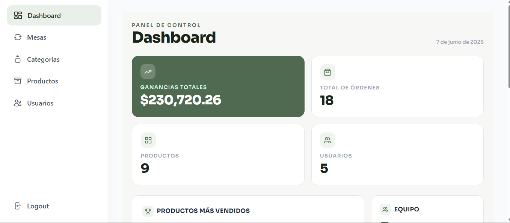
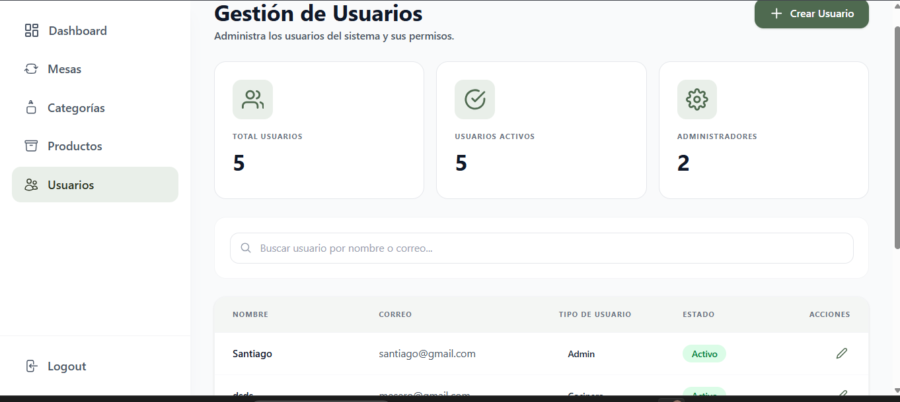
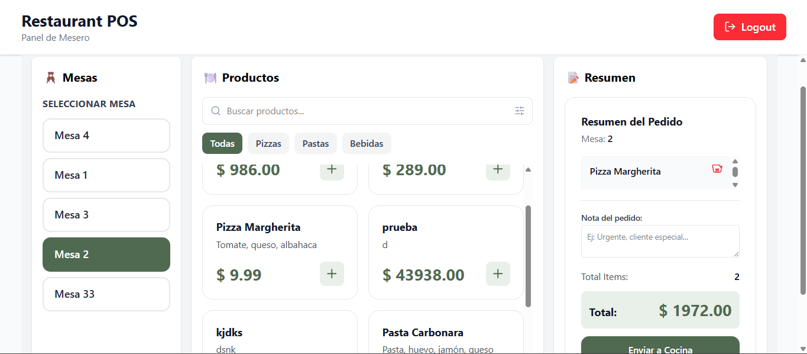
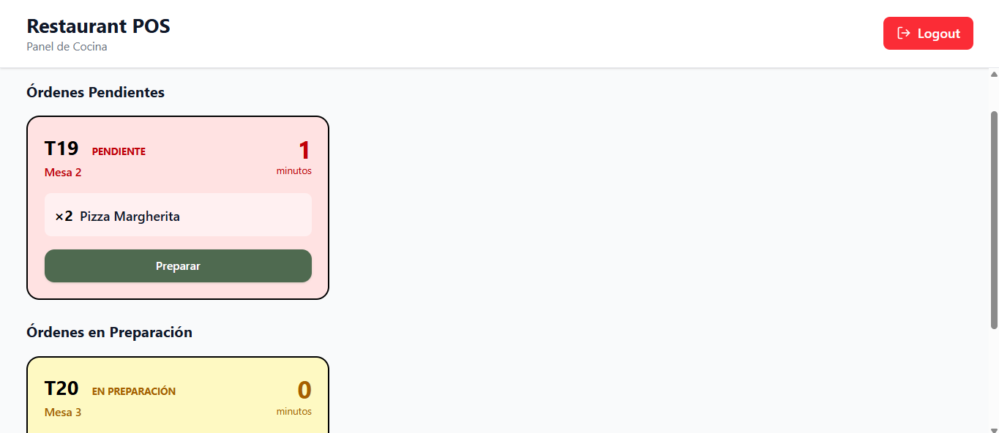

# 🍽️ Pedidos Restaurante

Sistema de gestión de pedidos para restaurante en tiempo real. Permite a los meseros tomar órdenes desde su interfaz, que llegan instantáneamente a cocina. Los cocineros gestionan el estado de cada orden y los meseros cierran la cuenta cuando el cliente paga. Un administrador tiene control total sobre mesas, productos, categorías y usuarios.

---

## 📋 Tabla de Contenidos

- [Screenshots](#-screenshots)
- [Características](#-características)
- [Tecnologías](#-tecnologías)
- [Arquitectura](#-arquitectura)
- [Requisitos previos](#-requisitos-previos)
- [Inicio rápido](#-inicio-rápido)
- [Roles y funcionalidades](#-roles-y-funcionalidades)
- [Créditos](#-créditos)

---

## 📸 Screenshots

### 🔐 Login


### 🧑‍💼 Dashboard — Administrador


### 👥 Gestión de Usuarios


### 🧑‍🍽️ Panel del Mesero


### 👨‍🍳 Panel de Cocina


---

## ✨ Características

- 🧾 Creación de órdenes con múltiples productos por mesa
- 🔄 Actualización de estado de órdenes en tiempo real (WebSockets)
- 👨‍🍳 Panel de cocina con órdenes activas
- 🪑 Gestión de mesas con disponibilidad en vivo
- 🔐 Autenticación con JWT por roles (admin, mesero, cocinero)
- 🐳 Backend completamente dockerizado

---

## 🛠️ Tecnologías

### Backend
| Tecnología | Uso |
|---|---|
| [NestJS](https://nestjs.com/) | Framework principal del servidor |
| [PostgreSQL](https://www.postgresql.org/) | Base de datos relacional |
| [TypeORM](https://typeorm.io/) | ORM para manejo de entidades |
| [Docker](https://www.docker.com/) | Contenedorización del backend y BD |
| [JWT](https://jwt.io/) | Autenticación y autorización por roles |
| [WebSockets](https://docs.nestjs.com/websockets/gateways) | Comunicación en tiempo real |
| [Swagger](https://swagger.io/) | Documentación de la API |

### Frontend
| Tecnología | Uso |
|---|---|
| [React](https://react.dev/) | Interfaz de usuario |
| [TypeScript](https://www.typescriptlang.org/) | Tipado estático |
| [Vite](https://vitejs.dev/) | Bundler y servidor de desarrollo |
| [Tailwind CSS](https://tailwindcss.com/) | Estilos utilitarios |
| [Docker](https://www.docker.com/) | Contenedorización del frontend |

---

## 🏗️ Arquitectura

```
restaurante/
├── app/                  # Backend NestJS
│   ├── src/
│   │   ├── modules/      # Módulos (usuarios, mesas, órdenes, productos...)
│   │   ├── entities/     # Entidades TypeORM
│   │   ├── dtos/         # Data Transfer Objects
│   │   ├── gateways/     # WebSocket gateways
│   │   └── guards/       # Guards JWT
│   ├── Dockerfile
│   └── docker-compose.yml
└── frontend/             # Frontend React
    ├── src/
    │   ├── modules/      # Módulos por rol (admin, mesero, cocina)
    │   ├── services/     # Llamadas a la API
    │   ├── context/      # AuthContext
    │   └── hooks/        # Hooks personalizados
    └── vite.config.ts
```

---

## ✅ Requisitos previos

- [Docker](https://www.docker.com/) y Docker Compose
- [Node.js](https://nodejs.org/) v20 o superior
- [npm](https://www.npmjs.com/)

---

## 🚀 Inicio rápido

```bash
# 1. Levantar el backend
cd app
docker compose up -d

# 2. Levantar el frontend
cd ../frontend
docker compose up -d
# o en modo desarrollo:
npm install && npm run dev
```

Para instrucciones detalladas de cada parte:
- 📦 [Documentación del Backend](./app/README.md)
- 🎨 [Documentación del Frontend](./frontend/README.md)

---

## 👥 Roles y funcionalidades

### 🧑‍💼 Administrador
- Gestión completa de **usuarios** (crear, editar, desactivar)
- Gestión de **mesas** (activar/desactivar, crear)
- Gestión de **productos** y **categorías**
- **Dashboard** con métricas de ganancias, órdenes y productos

### 🧑‍🍽️ Mesero
- Ver mesas disponibles en tiempo real
- Crear órdenes con productos para una mesa
- Ver órdenes activas de su mesa
- Marcar orden como **pagada** al finalizar

### 👨‍🍳 Cocinero
- Ver todas las órdenes entrantes en tiempo real
- Cambiar estado de orden:
  - `Pendiente` → `Preparando`
  - `Preparando` → `Listo`

---

## 🤖 Créditos

| Parte | Autor |
|---|---|
| Backend (NestJS, PostgreSQL, Docker) | Santiago Vera |
| Integración API y lógica frontend | Santiago Vera |
| Diseño UI y componentes React | Santiago Vera + [Claude](https://claude.ai) (Anthropic AI) |

> 💡 Los componentes de interfaz fueron desarrollados con asistencia de [Claude](https://claude.ai) (Anthropic AI), con integración a la API y lógica de negocio implementadas manualmente.

---

## 👤 Autor

**Santiago Vera**  
[Portfolio](https://sankiss55.github.io/KISSAN-STUDIO/) · [GitHub](https://github.com/sankiss55)

---

## 📄 Licencia

Este proyecto es de uso educativo y de práctica con NestJS y React.